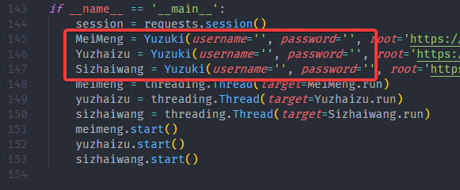

# YUZUKI
美萌、死宅网、御宅族自动签到回复关注

# 使用教程
>* 使用前提是有这些论坛的账号
>* [如何安装Python3](https://www.liaoxuefeng.com/wiki/1016959663602400/1016959856222624)
>* [如何安装requests](https://zhuanlan.zhihu.com/p/46001223)
>* 打开yuzuki.py将账号密码填入下图位置
> 
>* 进入代码所在的文件夹，运行cmd，进入命令提示符窗口，输入下面的命令
```
python yuzuki.py
```
